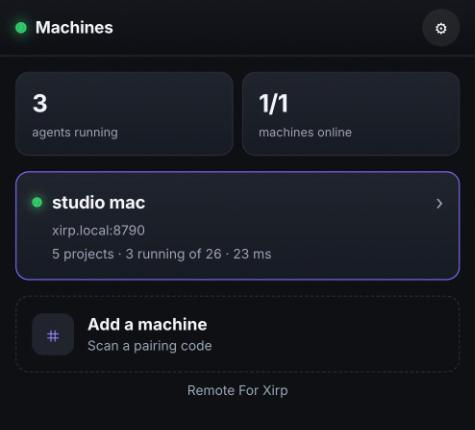
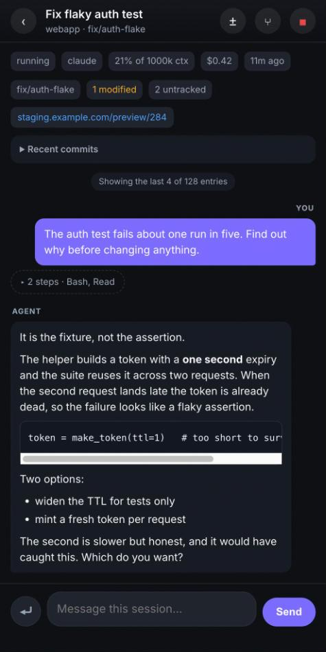
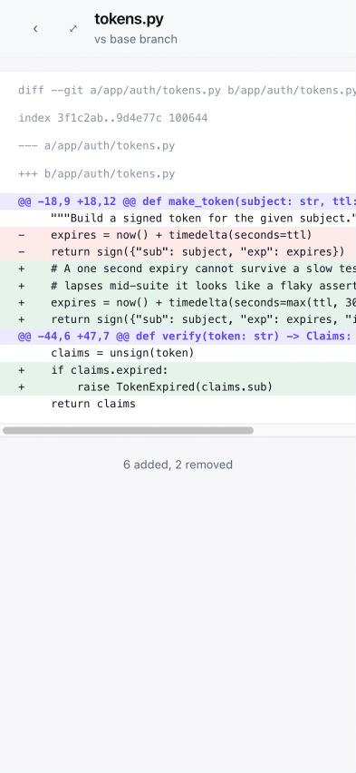
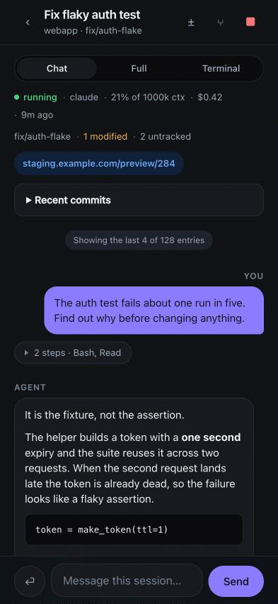

# Remote For Xirp

**See and steer your coding agents from your phone.**

A mobile web app for [Xirp](https://xirp.dev), the agent desktop app from Spotify, so the
sessions running on your Mac — Claude Code, Codex, Gemini, or whatever else Xirp is
driving — can be watched and answered from an iPhone or Android without going back to
the desk. It runs on your own network, not through anyone's cloud.

One Go binary with the UI embedded. No build step for the front end, no node_modules,
no database.

> **Unofficial.** Xirp is a Spotify product. This project is not made, endorsed or
> supported by Spotify, and is not derived from Xirp: the repository contains no code,
> stylesheets, icons or assets from the application — only this project's own client for
> the daemon's local WebSocket API. "Xirp" and "Spotify" are used to name what this talks
> to, and are trademarks of their owner.

<p align="center">
  
  
  
  
</p>

## Install

```sh
curl -fsSL https://remote-for-xirp.cdevries.dev/install.sh | sh
```

That drops a checksum-verified universal binary into `~/.local/bin` and stops. Nothing
starts listening, because you piped a script into a shell. Starting it is one explicit
command, which also prints the QR code to scan:

```sh
xirp-remote interfaces                # which address can a phone reach?
xirp-remote install --generate-key    # start it, and print a pairing QR code
```

Scan the code with your phone, and that is the setup. `install` writes a launchd user
agent, so it comes back at login and after a crash.

Building from source, every CLI subcommand, and pinning which address it serves on:
[`docs/service.md`](docs/service.md).

## Requirements

| | |
|---|---|
| **macOS** | Not incidental. The daemon's access token exists only in the Xirp app's process environment, which `ps -E` exposes to the same user and nobody else — so this has to run as you, on that machine. |
| **Xirp, running** | Sessions come from the local daemon of Xirp itself, Spotify's agent desktop app. This does not replace it: when the app is quit there is nothing to control. |
| **A phone on the same network** | Or reaching the machine over a VPN. |
| **Go 1.26+** | Only to build it yourself. Nothing else: no Node, no package manager, no database. |

## What it does

| | |
|---|---|
| **Machines, then folders, then sessions** | Opens on the machines it knows about, each with a live dot, project and running counts and round-trip time; then that machine's projects, then their sessions. A session list only means something once you have said which machine you mean. |
| **Pair by QR** | Scanning is the primary action on a cold start; typing an address is there but secondary. The link carries the key in the URL *fragment*, so it never reaches a server log. |
| **Chat, full transcript, or the real tmux pane** | The pane is the session's actual one, ANSI colours and all, so slash commands, model pickers and permission prompts work without this app knowing they exist. A key row supplies Escape, Tab, arrows, Enter and Ctrl-C. |
| **Answer a session** | Enter sends, Shift+Enter inserts a newline. **Submit** types and presses Enter so the agent acts; **Type** leaves the text in its input unsent. |
| **Review the diff** | What a session changed, uncommitted and against its base branch, per-file counts, the rendered unified diff, the whole file when the diff is not enough, and a link to the branch's pull request when the daemon knows of one. |
| **Notifications** | Web Push when a session finishes, fails, or wants an answer — it arrives with the app closed. Tapping it opens that session. |
| **Start, fork, hand over** | Create a session with a project, agent, model and goal, optionally on a new branch; fork a conversation when the agent went down a wrong path; hand a session to a different agent, keeping its history. |
| **Search every session** | Metadata, messages and JSONL transcripts, including completed sessions the list no longer shows. |
| **See the state of the work** | Branch with staged, modified and untracked counts, recent commits, and any URLs the agent printed as tappable links — loopback addresses filtered out, since they would not resolve on a phone. |
| **Restore and rename** | Revive or dismiss sessions after Xirp restarts, and rename one by hand or by asking the agent to retitle it from the conversation. |
| **Installable** | A PWA that lives on the home screen and opens full-screen. An Android APK can be built for your own origin — see [`deploy/android/`](deploy/android/), which also explains why one cannot be published for everyone. |
| **Diagnostics** | Whether the daemon is reachable, tmux availability and live pane count, the daemon's database load, which feature modules this edition has, and the daemon's own log filtered to warnings and errors — which is where the real reason for a failure appears. |
| **Multiple machines** | Each host is one Mac running Xirp. Add others and switch between them. |
| **Light and dark** | Follows the phone by default, with an explicit override in Settings. The terminal view stays dark in both, because the agent picked its ANSI colours for a dark background. |

Sessions without a tmux pane are marked and their composer hidden, because
`session:message` is fire-and-forget and sending into a dead pane otherwise looks like
success. Search is hidden where the edition lacks the module, rather than offering a box
that can only return nothing.

## What it deliberately does not do

- **Approve permission prompts.** The daemon holds a request open for at most 500 ms
  before falling through to the agent's own dialog, so no polling client can catch one.
  The terminal view answers the agent's prompt directly instead. Detail:
  [`docs/protocol.md`](docs/protocol.md#why-there-is-no-remote-approval-of-permission-prompts).
- **Write to git, attach a terminal, delete a session, or change any app setting.**
  33 of the daemon's 212 message types are reachable; `git:` writes, `terminal:`,
  `session:delete` and every `settings:` mutation are simply not proxied. The one
  `settings:` call is `getModels`, which reads the model list for the new-session sheet.
- **Run anywhere but macOS**, for the reason in Requirements.

## Security

This app can type into agent sessions, which is arbitrary code execution on the Mac as
the user running Xirp. Treat it accordingly: keep it on your own network, with no port
forward and no public hostname.

`install --generate-key` mints an access key and turns on the login gate, which is the
default worth using. The key is compared in constant time, wrong keys are delayed 400 ms,
and it is held in an `HttpOnly` `SameSite=Lax` cookie; the pairing QR carries it in the
URL fragment so it never reaches a server log. `install --no-key` runs it open instead,
which is only reasonable when the network itself is the boundary. Cross-origin access is
enabled **only** when a key is required — on an open instance, echoing the origin back
would let any page you happen to visit drive your sessions.

Full threat model and how to report something: [`SECURITY.md`](SECURITY.md).

## Docs

| | |
|---|---|
| [`docs/service.md`](docs/service.md) | CLI reference, building from source, choosing an address, how the launchd agent works. |
| [`docs/api.md`](docs/api.md) | Configuration, notifications, and the HTTP endpoints this serves. |
| [`docs/protocol.md`](docs/protocol.md) | How it talks to the Xirp daemon, and four traps in that API that cost real debugging time. |
| [`docs/proxy.md`](docs/proxy.md) | Putting it behind a reverse proxy, including the case where the Mac is a laptop that moves. |

## License

[MIT](LICENSE). Issues and pull requests welcome.
